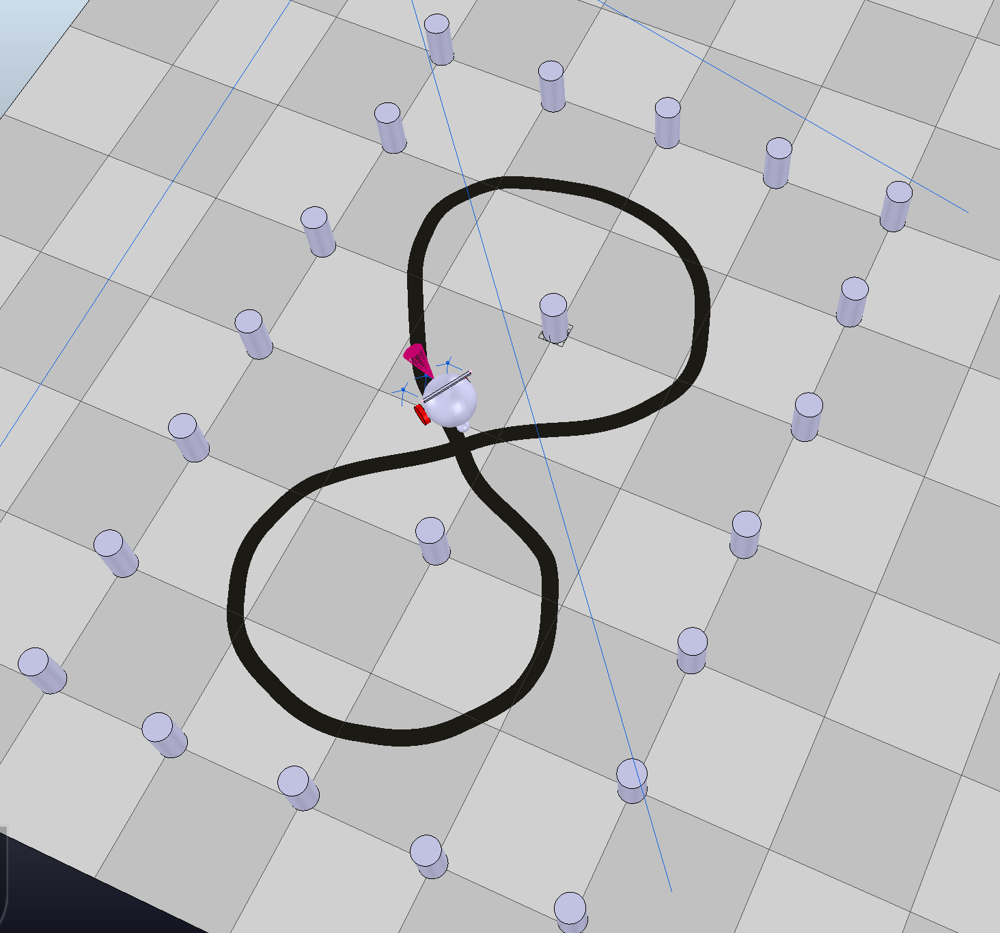
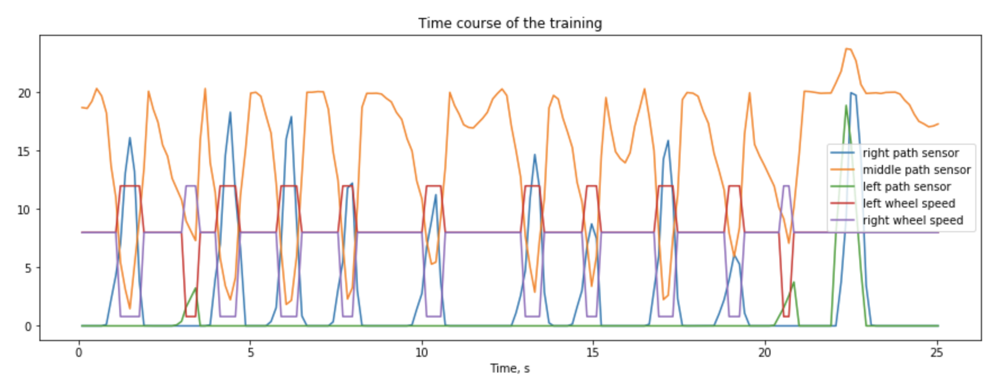
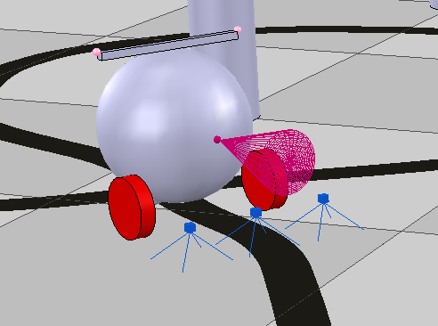
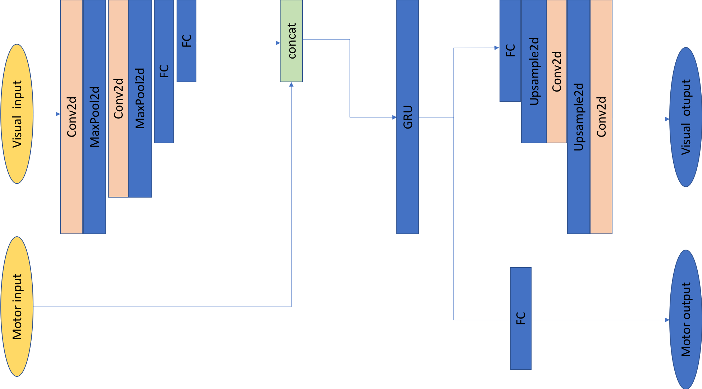
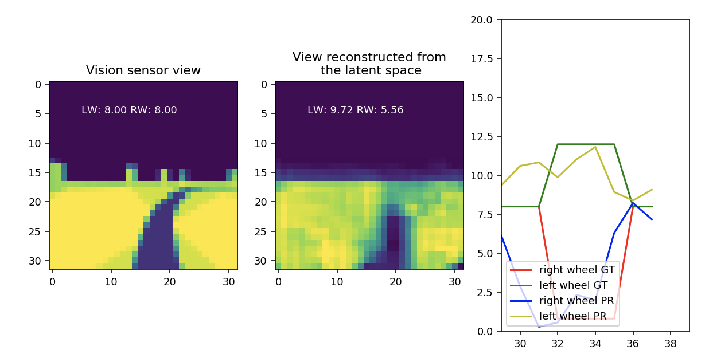
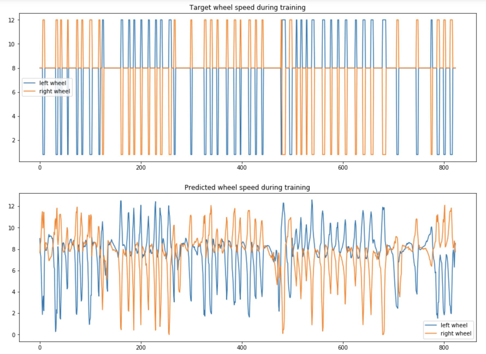

# C/RNN-controlled visually guided robot in VREP

## Background

This project leverages the power of both convolutional neural networks (CNN) and recurrent neural networks (RNN) in a visually-guided robot control task. CNNs work best when used for visual feature extraction from raw pixels, while RNNs are capable of capturing temporal dependencies and can make 'decisions' based on previously encountered sta¥-tes. This property is essential for stateful agents, i.e. those capable of making appropriate choices given not only the current but also a sequence of prior states. A case in point is a robot that has the seemingly simple task of following a figure-of-eight-shaped track. When such a robot moves along the track and reaches the intersection of two lines it must continue to move naturally along the track without getting stuck in one lap of the figure of eight. This is only possible if the model that maps the robot's current position to the wheels' speeds takes into account not only were the robot is, but also where it was a few moments before. In what follows below I describe my project in which a simulated robot was controlled by a CNN-RNN model. The model was able to reach satisfactory performance and even some robustness against mild visual noise and mild physical disturbances knocking the robot off the track.

## Methods

### Robot and environment

The robot was constructed off of BubbleRob, a built-in robot model in VREP (Coppelia Robotics GmbH, Zürich, Switzerland), commercially available robotics simulation software. The robot could be controlled by changing the rotation speeds of its two driving wheels. The environment consisted of a level floor with a figure-of-eight-shaped track

<em>Figure 1: Robot training and evaluation environment.</em>
  

The environment was flanked by 20 barrels, another two were positioned roughly in the middle of the laps of the track. All of these barrels were task-irrelevant, i.e. the robot's guidance updates did not depend on the apparent position of theses barrels in the frame (as discussed in more detail below).

### Training data

The training data were a list of N 2-tuples (visual data, motor data) where N was the number of training steps during each of which the algorithm logged one frame V_i of size 32 x 32 pixels taken by the forward-looking perspective view camera (60 deg. view angle), and one tuple m_i, whose elements represented the left and right motor speeds. These data were collected during the robot's algorithm-controlled movement along the track. It is important to emphasise the distinction between algorithm- and model-controlled movement. To collect data with which to train the model, I needed some hard-coded algorithmic way to get the robot to move along the track and chose the following scheme. I added three cameras to the robot, such that their positions were all along a line perpendicular to the robot's longitudinal axis (Fig. 3). At the beginning of the training data collection session, the robot was moving straight at a constant speed. After a few moments the robot starts to diverge from the track such that the track gets slightly off the robot's midline (either to the right or to the left). This misalignment is sensed by the three guidance frontal cameras. If the robot moves left too far away from the track, the reading of its left camera is low, middle is slightly higher and that of the right is the largest. 

<em>Figure 2: Sensory and motor data during training (a 25-s period is shown).</em>
  

Once a certain relative difference between the readings of these cameras is reached, the algorithm gets the robot back on track by temporarily changing the wheel rotation speeds. For example, when the robot is too far left away from the track, the algorithm increases its left wheel speed while decreasing its right wheel speed, when the intensity readings of both right and left cameras are approximately the same (with maximum intensity at the middle camera), the speeds of both wheels are reset to the same original value (Fig. 2).
The training data was collected from 824 simulation steps (i.e. N = 824), which took the robot to complete about two full laps along the track.

<em>Figure 3: Cameras (three blue cubes) used for training data collection.</em>
  

### Control model architecture

The control model architecture is shown in Fig. 4. The training data were used to fit the control model which was implemented in PyTorch and trained on Saion, OIST's HPC cluster (test-gpu node). The number of trainable parameters was 184157. The first two convolutional layers extract task-rele¥-vant features from the the raw black-and-white image captured by the forward-looking camera on the robot and compress it into a latent representation of size 10. This representation is concatenated with a the current motor input of size 2 (left wheel speed and right wheel speed) and fed into a recurrent layer (GRU). Adding a recurrent layer in the middle of the network allows the model to achieve better performance. The GRU has a simpler design and was shown to have better convergence compared to LSTM on some benchmarks [[1]](#1). Then a dense layer (output motor pathway) maps the latent representation to a 2-vector of wheel speeds for the next time step. At the same time, the latent representation is forced to  contain sufficient information needed to reconstruct a picture of what is coming ahead (Fig. 5). 

<em>Figure 4: Control model architecture.</em>
  

<em>Figure 5: Visual input (left pane). Prediction of the next visual input (middle pane). Wheel speeds predicted by the model and those used during training (shown for reference) (right pane).</em>
  

### Training procedure

The model has two losses: visual and motor. The visual loss, if not scaled to a value comparable to that of the motor loss, will contribute much more to the overall loss and calculated gradients. Therefore, to achi¥-eve better training results, I trained the model in several steps gradually decreasing the relative weight of the visual loss. Specifically, when the visual loss stops decreasing while the motor loss is still high, I add more weight to the motor (or decrease the weight of the visual) loss to encourage the motor loss to decrease faster. This makes sense because the learning objective is no so much to better predict what is coming ahead, but to stay on the track as accurately as possible. After training the model was able to predict quite well the wheel speeds (see Fig. 6).

<em>Figure 6: Model performance.</em>
  

## Performance evaluation

The robot was able to stay on course even if the image is severely distorted by adding random noise to the visual input. Moreover, the robot tolerated mild physical disturbances (which were simulated at specified times after the beginning of the (see [video](https://youtu.be/nAUBwK1vufM})), by applying a force vector to the entire robot of part thereof). However, in some cases the robot was not able to recover after either visual or motor disturbance. The ability to withstand disturbances depended on the strength of the disturbance (i.e. the amount of noise added to the visual input, or the force applied to the robot). I did not specifically study the relationship between the ability of the robot to stay on track and disturbance magnitude.

## Conclusion

In this project I created a model of a two-wheeled robot that, after training, is able to stay on track thanks to motor guidance updates issued by a previously trained model. The control model implements a visual and and motor 'pathways'. The visual pathway is a deep convolutional neural network (CNN), whose output is concatenated with the motor input, which I call 'afferent motor pathway', before it is fed into a recurrent layer. The robot stays on course even if the image is severely distorted by adding random noise to the visual input. Moreover, most of the time the robot manages to stay on track even if physically disturbed. It is interesting that the model seems to disregard the barrels in the environment and only 'pay attention' to the position of the black line in the current visual input. This can be seen from the fact that very rarely did the model 'paint' a barrel in the reconstructed image. Perhaps I could push the model further by masking the track entirely during the training time to force it to base its predictions not on the most salient feature in the frame (the thick black line corresponding to the track), but other less straightforward visual information, i.e. the relative positions of the barrels in the frame. I did not get that far because I was concerned that -- having only limited time in which to to work on the project -- I would not be able to complete the project in time.

## References

<a id="1">[1]</a> 
Junyoung Chung. Gated Recurrent Neural Networks on Sequence Modeling arXiv: 1412.3555v1[cs.NE]11Dec 2014. Int. Conf. Mach. Learn., 2015.

## Code

Make sure you have following files in your directory, in order to run the various examples:

1. vrep.py
2. vrepConst.py
3. the appropriate remote API library: "remoteApi.dll" (Windows), "remoteApi.dylib" (Mac) or "remoteApi.so" (Linux)
4. simpleTest.py (or any other example file)
5. see videos here:
	- https://youtu.be/8qw4GE_yjWQ
	- https://youtu.be/nAUBwK1vufM
	- https://youtu.be/U8Ct89bDGDI
6. read the full description in the pdf 'Final_Robotics_Project.pdf'.
7. get trained model here: https://www.dropbox.com/sh/nfjbijwp8f4dpgf/AAD7A-9dEjDaMhnmXAlC-HFya?dl=0
8. The complete code for the training is in iRobot_Training_torch_cpu.ipynb (or, if you have CUDA, iRobot_Training_torch_gpu.ipynb).
